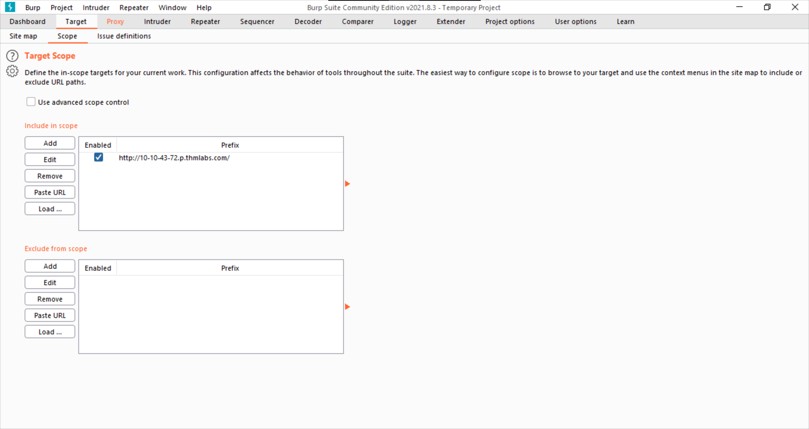

# Burp Suite: The Basics

This is the first room of [Burp Suite](modules/BurpSuite/README.md) [module](modules/README.md). Here we get an introduction to [Burp Suite](modules/BurpSuite/README.md) as well as Proxy and Target modules.


## Task 1 [Introduction] Outline

**Instructions to start and access the box, as well as a room overview.**

1. Deploy the machine attached to the task by pressing the green "Start Machine" button, as well as the AttackBox (using the "Start AttackBox" button at the top of the page) if you are not using your own machine.  

    _**Note:** If you are not using the AttackBox and want to connect to this machine without the VPN, you can do so using this link once the machine has fully loaded and an IP address is displayed:*[https://LAB_WEB_URL.p.thmlabs.com](https://lab_web_url.p.thmlabs.com/)
    
    > Just start the machine and access it through the given link.
    
    ```
    No answer needed
    ```

***Note: I will be using this method to access the website.***

---

## Task 2 [Getting Started] What is Burp Suite?

**A basic intro to Burp and it's editions.**

1. Which edition of Burp Suite will we be using in this module?

    > Read the description.

    ```
    Burp Suite Community
    ```

2. Which edition of Burp Suite runs on a server and provides constant scanning for target web apps?

    > Read the description.

    ```
    Burp Suite Enterprise
    ```

3. Burp Suite is frequently used when attacking web applications and ______ applications.

    > Read the description and fill in the blank.

    ```
    Mobile
    ```

---

## Task 3 [Getting Started] Features of Burp Community

**Intro to modules in Burp and extensions.**

1. Which Burp Suite feature allows us to intercept requests between ourselves and the target?

    > Read the description.

    ```
    Proxy
    ```

2. Which Burp tool would we use if we wanted to bruteforce a login form?

    > Read the description.

    ```
    Intruder
    ```

---

## Task 4 [Getting Started] Installation

**Installation instructions for Community Edition.**

1. If you have chosen not to use the AttackBox, make sure that you have a copy of Burp Suite installed before proceeding.

    ```
    No answer needed
    ```

---

## Task 5 [Getting Started] The Dashboard

**Intro to the Dashboard interface**

1. Open Burp Suite and have a look around the dashboard. Make sure that you are comfortable with it before moving on.

    ```
    No answer needed
    ```

---

## Task 6 [Getting Started] Navigation

**Instructions on how to navigate the GUI and common keyboard shortcuts for navigation.**

1. Get comfortable navigating around the top menu bars.

    ```
    No answer needed
    ```

---

## Task 7 [Getting Started] Options

**Instructions about managing User and Project Options.**

1. Change the Burp Suite theme to dark mode

    > This option can be found in User Options > Display > User Interface > Theme: Dark

    ```
    No answer needed
    ```


2. In which *Project Options* sub-tab can you find reference to a "Cookie jar"?

    > Go through the Project Options. You will find "Cookie jar" pretty easily.

    ```
    Sessions
    ```


3. In which *User options* sub-tab can you change the Burp Suite update behaviour?

    > Again, browse through User Options.

    ```
    Misc
    ```


4. What is the name of the section within the *User options* "Misc" sub-tab which allows you to change the Burp Suite key bindings?

    > Should be pretty obvious once you visit User Options > Misc.

    ```
    Hotkeys
    ```


5. If we have uploaded Client-Side TLS certificates in the *User options* tab, can we override these on a per-project basis (Aye/Nay)?

    > Yes. Most User Options can be overridden in Project Options. You can find this specific option in Project Options > TLS > Client TLS Certificates > Override user options.

    ```
    Aye
    ```


6. There are many more configuration options available. Take the time to read through them.

    In the next section, we will cover the Burp Proxy -- a much more hands-on aspect of the room.

    ```
    No answer needed
    ```

---

## Task 8 [Proxy] Introduction to the Burp Proxy

**Intro to Proxy module, its sub-tabs and basic config.**

1. Which button would we choose to send an intercepted request to the target in Burp Proxy?

    > We "forward" the request.

    ```
    Forward
    ```


2. **[Research]** What is the default keybind for this?

    _**Note:** Assume you are using Windows or Linux (i.e. swap Cmd for Ctrl)._

    > You can find the keybinding by doing a simple google search or by looking at User Options > Misc > Hotkeys

    ```
    Ctrl+F
    ```


---

## Task 9 [Proxy] Connecting through the Proxy (FoxyProxy)

**Instructions to install and configure FoxyProxy**

1. Read through the options in the right-click menu.

    There is one particularly useful option that allows you to intercept and modify the *response* to your request.

    What is this option?

    _**Note:** The option is in a dropdown sub-menu._

    > Go through the right-click menu and see what fits the description. It's Do intercept > Response to this request.

    ```
    Response to this request
    ```


2. **[Bonus Question -- Optional]** Try installing FoxyProxy standard and have a look at the pattern matching features.

    > Have a go at this if you feel like it!

    ```
    No answer needed
    ```

---

## Task 10 [Proxy] Proxying HTTPS

**Instructions to set up HTTPS support for Burp Proxy**

1. If you are not using the AttackBox, configure Firefox (or your browser of choice) to accept the Portswigger CA certificate for TLS communication through the Burp Proxy.

    > Follow the given instructions and do this if needed.

    ```
    No answer needed
    ```

---

## Task 11 [Proxy] The Burp Suite Browser

**Intro to using and troubleshooting inbuilt browser.**

1. Using the in-built browser, make a request to `http://MACHINE_IP/` and capture it in the proxy.

    > Pretty self explanatory. Open the inbuilt browser with intercept on in Proxy and browse to `http://MACHINE_IP/`.

    ```
    No answer needed
    ```


---

## Task 12 [Proxy] Scoping and Targeting

**Instruction to configure scope in Target tab.**

1. Add `http://MACHINE_IP/` to your scope and change the Proxy settings to only intercept traffic to in-scope targets.

    See the difference between the amount of traffic getting caught by the proxy before and after limiting the scope.
    
    > Follow the instructions in the room to do this. You will notice that you are capturing much less traffic.

    ```
    No answer needed
    ```

!



---

## Task 13 [Proxy] Site Map and Issue Definitions

**Intro to Target module and its sub-tabs.**

1. Take a look around the site on `http://MACHINE_IP/` -- we will be using this a lot throughout the module. Visit every page linked to from the homepage, then check your sitemap -- one endpoint should stand out as being very unusual!

    Visit this in your browser (or use the "Response" section of the site map entry for that endpoint)

    What is the flag you receive?
    
    > With intercept off in Proxy (but with the browser configured to send all traffic through the proxy), browse through the whole web site. (Click every link you find! I usually prefer to <kbd>Ctrl</kbd> + click all links to open in new tabs and close them each after reading through with <kbd>Ctrl</kbd> +<kbd>W</kbd>). Then check the site map. You will see a weird seemingly random file. Clicking on it reveals that it was referred by *http:/MACHINE_IP.p.thmlabs.com/ticket/* and a *GET* request was made to it. The response reveals the flag.

    ```
    THM{NmNlZTliNGE1MWU1ZTQzMzgzNmFiNWVk}
    ```

    

2. Look through the Issue Definitions list.

    What is the typical severity of a Vulnerable JavaScript dependency?
    
    > Scroll down the Issue Definition list and find "Vulnerable Javascript Dependency".

    ```
    Low
    ```
    
    

---

##