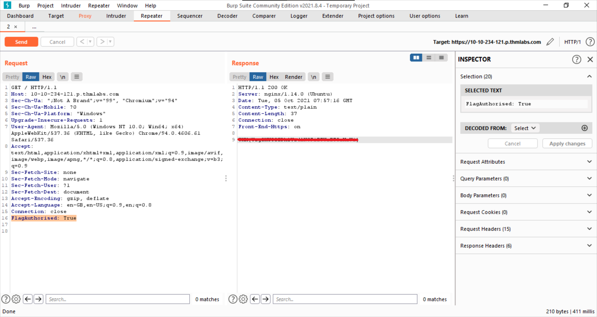

# Burp Suite: Repeater
  
> Vidath Dissanayake | 2021/10/02 | Sri Lanka  
> [Room link](https://tryhackme.com/room/burpsuiterepeater)  
> [TryHackMe](https://tryhackme.com)
  
This room is the sequel to [Burp Suite: Basics](../burpsuitebasics/burpsuitebasics.md) and is the second room in [Burp Suite](../Burp%20Suite.md) [module](../../modules.md).
  
Here we get an introduction to the Repeater module.
  
---
---
  
## Task 1 [Introduction] Outline
  
****Instructions to start and access the box, as well as a room overview.**

1. Deploy the machine (and the AttackBox if you are not using your own attack VM), and let's get started!

    _**Note:** If you are not using the AttackBox and want to connect to this machine without the VPN, you can do so using this link once the machine has fully loaded and an IP address is displayed:_ [https://LAB_WEB_URL.p.thmlabs.com](https://lab_web_url.p.thmlabs.com/).
    
    > Just start the machine and access it through the given link.
    
    ```
    No answer needed
    ```

    ***Note: I will be using this method to access the website.***
    
---

## Task 2 [Repeater] What is Repeater?

**Introduction to repeater and it's interface.**

1. Familiarise yourself with the Repeater interface.

    ```
    No answer needed
    ```

---

## Task 3 [Repeater] Basic Usage

**A basic use case of Repeater.**

1. Capture a request to `http://MACHINE_IP` in the Proxy and send it to Repeater.

    Practice modifying and re-sending the request numerous times.
    
    > Should be easy. An instance of how it should look like is shown in the first screenshot in this task.

    ```
    No answer needed
    ```

---

## Task 4 [Repeater] Views

**Response and request views.**

1. Experiment with the available view options.

    > Try out different views. They all serve a purpose.

    ```
    No answer needed
    ```
    
2. Which view option displays the response in the same format as your browser would?

    > This is said in the room, and you should have figured out during experimenting.

    ```
    Render
    ```

---

## Task 5 [Repeater] Inspector

**Intro to Inspector.**

1. Get comfortable with Inspector and practice adding/removing items from the various request sections.

    > Try experimenting.

    ```
    No answer needed
    ```

---

## Task 6 [Practical] Example

**Altering a header with Repeater**

1. Capture a request to `http://MACHINE_IP/` in the Proxy and send it to Repeater.

    ```
    No answer needed
    ```

2. Send the request once from Repeater -- you should see the HTML source code for the page you requested in the response tab.

    Try viewing this in one of the other view options (e.g. Rendered).

    ```
    No answer needed
    ```

3. Using Inspector (or manually, if you prefer), add a header called `FlagAuthorised` and set it to have a value of `True`. e.g.:

    ```
    Headers with FlagAuthorised Added

    GET / HTTP/1.1
    Host: 10.10.185.0
    User-Agent: Mozilla/5.0 (X11; Ubuntu; Linux x86_64; rv:80.0) Gecko/20100101 Firefox/80.0
    Accept: text/html,application/xhtml+xml,application/xml;q=0.9,image/webp,*/*;q=0.8
    Accept-Language: en-US,en;q=0.5
    Accept-Encoding: gzip, deflate
    Connection: close
    Upgrade-Insecure-Requests: 1
    FlagAuthorised: True
    ```

    Send the request. What is the flag you receive?

    

---

## Task 7 [Practical] Challenge

**Causing a server error by sending unexpected data.**

1. Capture a request to one of the numeric products endpoints in the Proxy, then forward it to Repeater.

    > Capture a request to http