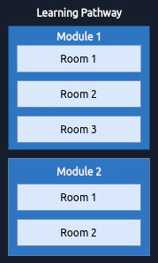

# Modules

Modules are made up of bite-sized labs.

## What are modules?

A learning pathway is made up of modules, and a module is made of bite-sized rooms (_think of a room like a mini security lab_).

test